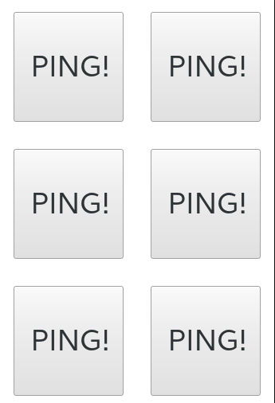

# What is audio pong?

This is a small nodejs server for your raspberry 3. 

It serves a sound board to your phone, you click on a tile to play a sound on you phone and another sound will be played on the raspberry, making a fun effect like ping pong, reload and fire, smash and cry...



## Install on a raspberry 3

on your raspberry, install these libs for audio and nodejs

```
sudo apt-get update

# install nodejs
sudo apt-get install -y npm wget
sudo npm install -g n
sudo n latest

# setup audio
sudo apt-get install -y mpg321
```

then start the server (you can add [use these techniques to start the server on startup boot](http://raspberrywebserver.com/serveradmin/run-a-script-on-start-up.html))

```
$ npm i
$ npm start
```

then open `http://[raspberry IP]:8080` on your phone and enjoy the sound on the 2 devices

> tip: you may need to type `amixer cset numid=3 1` to force the raspberry to output audio on the "analog" output instead of hdmi

> tip: you can use this command to test your audio: `speaker-test -t sine -f 440 -c 2 -s 1`

## add sounds to the board

You will need 2 mp3 sounds, one for ping (played by the phone) and one for pong (played by the raspberry)

* add 2 sounds to the [`sounds/` folder](./sounds)
* add an entry in [audio.json](./audio.json)
* change the number of sounds in [`index.html` on this line here](https://github.com/lexoyo/audio-pong/blob/master/index.html#L29)

Feel free to contribute your sounds here, only creative commons one please (home made or not) ;)

---
---

#### Notes on Doccker

$ sudo docker build . lexoyo/audio-pong
$ sudo docker run -p 8080:8080 lexoyo/audio-pong


sudo docker run -i -t -p 8080:8080 lexoyo/audio-pong /bin/bash


alsa :


 -v /dev/snd:/dev/snd
 --lxc-conf='lxc.cgroup.devices.allow = c 116:* rwm'
    -v /dev/shm:/dev/shm \
    -v /etc/machine-id:/etc/machine-id \
    -v /run/user/$uid/pulse:/run/user/$uid/pulse \
    -v /var/lib/dbus:/var/lib/dbus \
    -v ~/.pulse:/home/$dockerUsername/.pulse \
